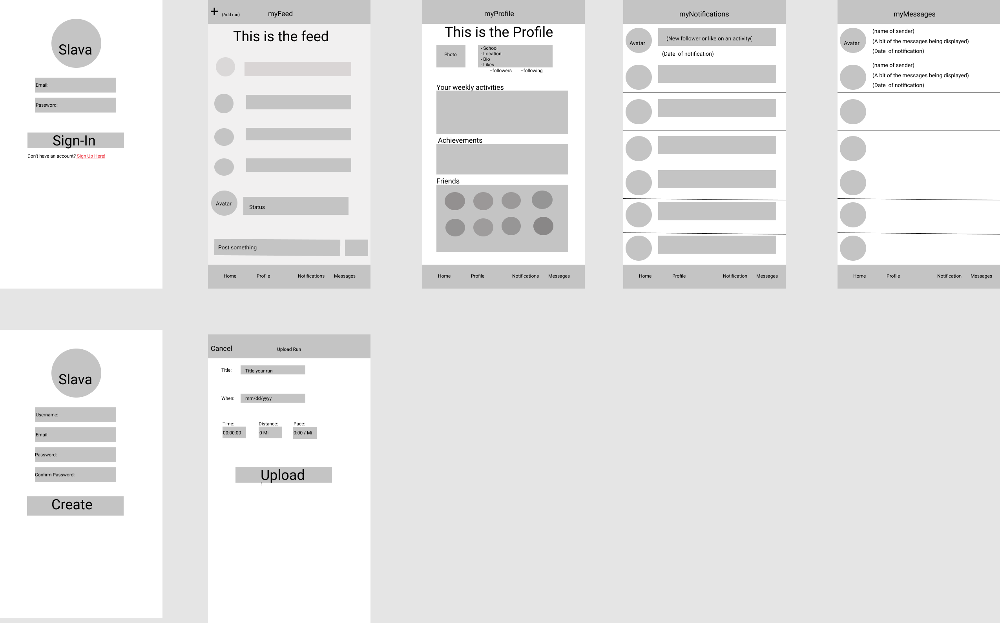

# Strava

## Table of Contents
1. [Overview](#Overview)
1. [Product Spec](#Product-Spec)
1. [Wireframes](#Wireframes)
2. [Schema](#Schema)

## Overview
### Description
An app targeted to runner where they can find fellow runners and conversate.

### App Evaluation
[Evaluation of your app across the following attributes]
- **Category:** Excerise
- **Mobile:** App will only be for mobile since Runners usually have their phone with them. Desktop functionality in the future.
- **Story:** Helps users track their progress, allows them to meet other runners and find fellow running events.
- **Market:** This app is for all age groups.
- **Habit:** This app could be used daily since excerise is a part of every healthy indivual's life. 
- **Scope:** This is particulary for runners, but it can be used for other activities in the future such a gym meets, walking, hiking, etc..

## Product Spec

### 1. User Stories (Required and Optional)

**Required Must-have Stories**

- [x] User can log in using email and password
- [x] User can sign up using email, password and upload avatar photo
* As a logged-in, I want to be able to track my miles and stats to see my progress.
- [X] As a logged-in user, I want to be able to send instant messages to my friend.
- [x] As a logged-in user, I can see the whole conversation with my friend.
- [X] As a logged-in user, I create a run
* As a logged-in user, I want to like any status that any of my friends posted regarding accomplishments/activities.
* As a logged-in user, I want to be able to gain “achievements” whenever I do specific tasks.
* As a logged-in user, I want to be able to update my profile.

**Optional Nice-to-have Stories**

* [fill in your required user stories here]
* ...

### 2. Screen Archetypes

* Login
   * User can use email and password to login into app
* Sign Up
    * User can sign up with username, email and password 
* Home/feed
   * User can see what fellow runners are up to
   * Users can post status in this page.
* Profile
    * User can see his profile, friends and achievements
* Messages
    * User can see messages here and create/send messages to fellow runners
* Create Run
    * User can create a run here 

### 3. Navigation

**Tab Navigation** (Tab to Screen)

* Home
* Profile
* Notifications
* Messages

**Flow Navigation** (Screen to Screen)

* Landing Page
   * Login Screen
   * Sign Up
* Home/Feed
   * Profile
   * My Notifications
   * Notifications
*Create Run

## Wireframes

### [BONUS] Digital Wireframes & Mockups

### [BONUS] Interactive Prototype

## Schema 
### Models
Main User
| Property | Type | Description |
| ------ | ------ | ------ |
| Objectid | string | id for main user
| Username| string | string for username
| Avatar | file | file that holds user avatar
| Email | string | string for email
| Password | string | string for password

Status
| Property | Type | Description |
| ------ | ------ | ------ |
| Objectid | string | unique id for user post
| Content | string | content of status
| Author | pointer to user | author of status
| likes | number | number of likes
| createdOn | DateTime | creation time
| updatedOn | DateTime | updated time

Run
| Property | Type | Description |
| ------ | ------ | ------ |
| Objectid | string | unique id for run
| Title | string | Title of run
| Time & Date | TimeDate | time of run
| Place | string | location of run
| Pace | DateTime | Pace of run

Message
| Property | Type | Description |
| ------ | ------ | ------ |
| Objectid | string | unique id for messafe
| Content | string | content of message
| avatar | pointer to user | image of sender
| time | DateTime | Time of message sent.

Profile
| Property | Type | Description |
| ------ | ------ | ------ |
| Objectid | pointer to parse object| pointer to user
| avatar | pointer to parse object | pointer to user
| email | pointer to parse object | pointer to user
| likes | array | array of strings
|location | string |location of user
| bio | string | quick bio

Notification
| Property | Type | Description |
| ------ | ------ | ------ |
| Objectid |string| unique notification id
| description | string | desc of notification

Friend
| Property | Type | Description |
| ------ | ------ | ------ |
| Objectid |pointer to parse object | pointer to object
| avatar | pointer to parse object | pointer to object
### Networking
Feed/home
- (Read/Get) Query all posts
- (Create/Post) Create a new status/ comment on a status
- (Delete) Remove existing status

Profile
- (Read/Get)Query logged in user object
- (UpdatePut) Update user avatar
- (Read/Get) Query logged user’s friends 

My Notifications
- (Read/Get) Query notifications
- (Delete) Delete notification

Create an account
- (Create/Post) Create a new user

Upload Run
- (Create/post) Create a new run

## App Walkthrough

